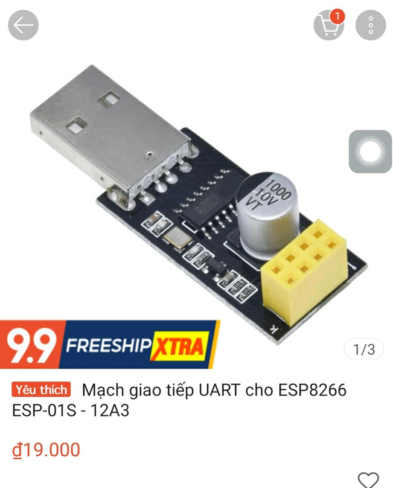
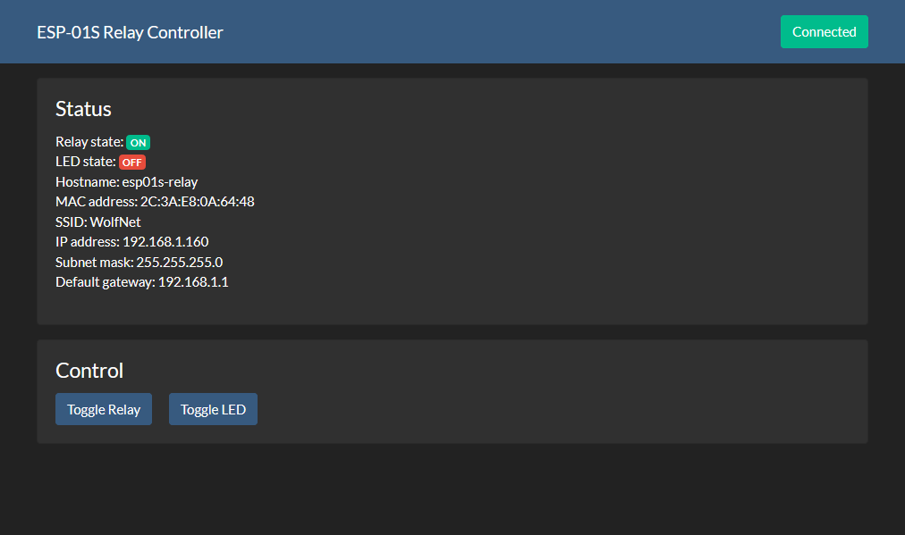
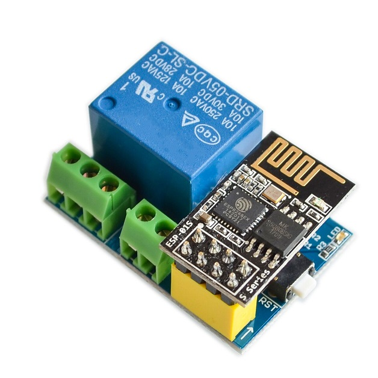

ESP-01S Relay Adruino Firmware
======================

Firmware for controlling an ESP-01S-based IoT relay.
---------

Connect Arduino
---------
Uart module 

Controll
---------

other device go to : ip address of Esp. 
File [apk](APP) app for android

Schematic
---------

License
-------
This project is published under the MIT License. For more informaion, please see [`LICENSE`](LICENSE).
