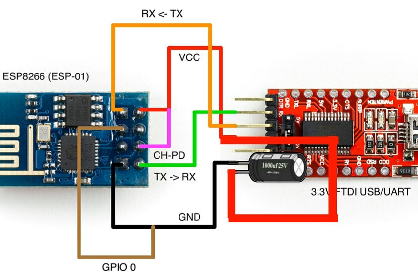
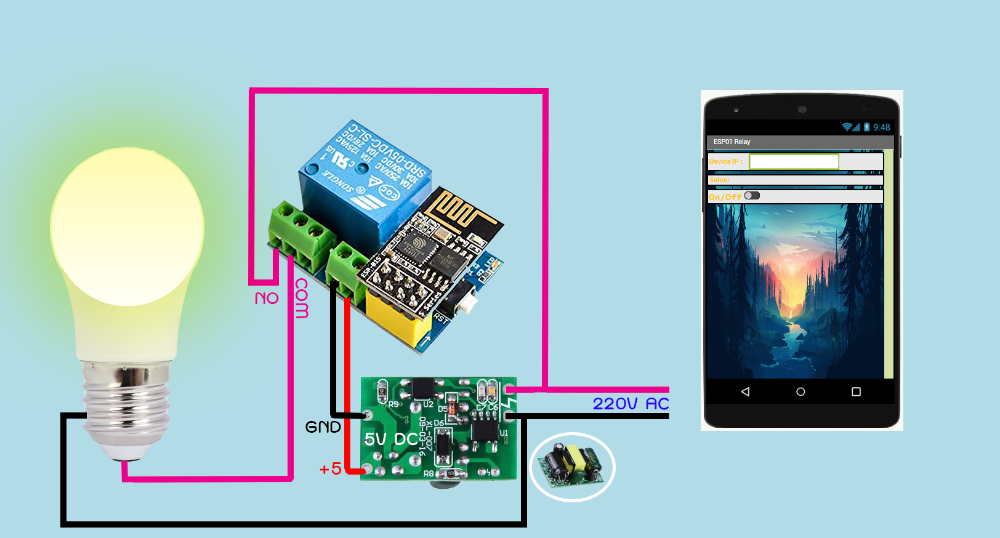

ESP-01S Relay Adruino Firmware
======================

Firmware for controlling an ESP-01S-based IoT relay.
Connect Arduino
---------
User Uart module 

Controll
---------

other device go to : ip address of Esp 
File apk app for android (APP)

Schematic
---------

License
-------
This project is published under the MIT License. For more informaion, please see [`LICENSE`](LICENSE).
